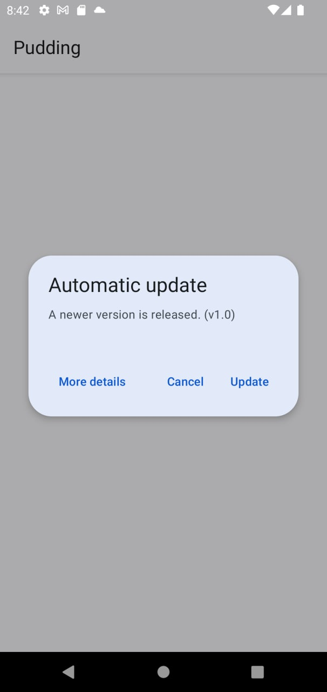

# Pudding 開發進度

## 2021/12/07

目前正在開發下一版布丁(v2.0)，將會對布丁的架構和介面進行大幅度的修改。(但是我要學測了所以沒什麼時間Orz)

### UI介面

介面將會採用Google的Material 3進行設計，程式將會自動使用系統色彩(Android 12以上)，否則預設會黃色色彩主題。

新增播放清單功能。

預計將主要和設定Activity整合為一個，新增項目對話框亦將移除。使用者可於Bottom Navigation切換至最近播放、新增項目、播放清單和設定等頁面。

加入歌詞功能，程式會根據播放項目的資訊自動由來源平台或者Google搜尋取得可用的歌詞。

使用新的圖示。

### 播放服務

新增Track物件作為項目的基礎物件，方便後續新增其他平台的支援。

### 其他

新增登入YouTube帳號功能，以播放一些需要登入才可播放的項目。

新增睡眠計時器，可於設定的時間後暫停播放器。
